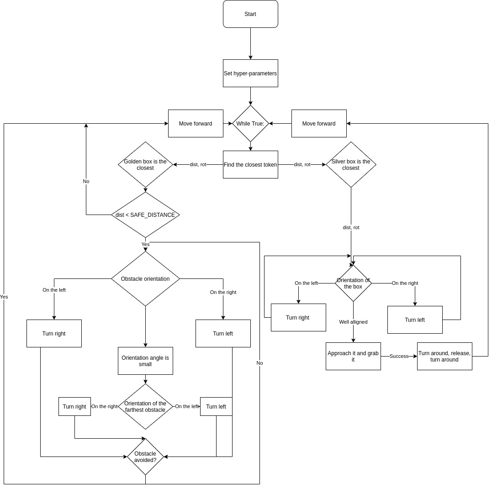

Assignment I: Python Robotics Simulator
================================

Course: Research Track I (104789)

## Prerequisites
----------------------

The simulator requires a Python 2.7 installation, the [pygame](http://pygame.org/) library, [PyPyBox2D](https://pypi.python.org/pypi/pypybox2d/2.1-r331), and [PyYAML](https://pypi.python.org/pypi/PyYAML/).

## Troubleshooting

When running `python run.py <file>`, you may be presented with an error: `ImportError: No module named 'robot'`. This may be due to a conflict between sr.tools and sr.robot. To resolve, symlink simulator/sr/robot to the location of sr.tools.

On Ubuntu, this can be accomplished by:
* Find the location of srtools: `pip show sr.tools`
* Get the location. In my case this was `/usr/local/lib/python2.7/dist-packages`
* Create symlink: `ln -s path/to/simulator/sr/robot /usr/local/lib/python2.7/dist-packages/sr/`

## Objective
-----------------------------
This is a simple, portable robot simulator developed by [Student Robotics](https://studentrobotics.org).
The robot should 
* Drive constantly around the circuit in the counter-clockwise direction
* Avoid touching the golden boxes
* When the robot is close to a silver box, it should grab it, and move it behind itself

## Running
-----------------------------
''python run.py solutions/assignment_solution.py''

## Flowchart of the algorithm
-----------------------------

## Hyper-parameters
-----------------------------
SAFE DISTANCE: minimal distance to detect an obstacle

d_th: distance to grab a silver token

a_th: angle to allign to a silver token
